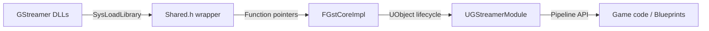

# GStreamer Integration for Unreal Engine 5

*Runtime-loaded GStreamer pipeline framework for UE5 — no compile-time dependencies, clean UObject integration.*

A foundational C++ framework for integrating the [GStreamer](https://gstreamer.freedesktop.org/) multimedia pipeline into Unreal Engine 5 projects.

## Overview

This project establishes the plugin architecture and core infrastructure needed to load and use GStreamer libraries at runtime inside an Unreal Engine 5 game module. The emphasis is on clean abstractions, runtime dynamic loading (no compile-time GStreamer dependency), and tight integration with UE5's logging and object systems.

Originally developed as part of a UAV simulation pipeline (see [RosendroUE](https://github.com/Kiriql/RosendroUE)).

**Status:** Foundational / Work in Progress — the infrastructure layer is complete; GStreamer pipeline logic is the intended next step.

## Features

- **Runtime dynamic library loading** — GStreamer DLLs are loaded at runtime via `SysLoadLibrary` / `SysFreeLibrary` / `SysGetProcAddress`, avoiding hard compile-time dependencies
- **Custom logging system** — four-level verbosity (Error, Warning, Info, Debug) with both ASCII and wide-character variants, routed into UE5's `LogGStreamer` log category
- **UObject wrapper** (`UGStreamerModule`) — exposes the GStreamer lifecycle to Unreal's reflection and garbage collection system
- **Interface factory pattern** (`GST_INTERFACE_IMPL` macro) — enforces controlled construction and destruction of GStreamer interface objects through factory methods
- **`SafeDestroy` utility** — RAII-friendly helper for interface cleanup
- **DirectX 12 / Vulkan rendering** configured (SM6 shader model) for high-end desktop targets
- **Enhanced Input System** integration

## Tech Stack

| Component | Details |
|-----------|---------|
| Engine | Unreal Engine 5.5 |
| Language | C++20 |
| Build system | Unreal Build Tool (UBT) |
| IDE | Visual Studio 2022 |
| Target platform | Windows 11 (primary), Linux (Vulkan path prepared) |
| Rendering API | DirectX 12 (SM6) / Vulkan SM6 |
| Multimedia | GStreamer (runtime-loaded) |

## Project Structure

```
Source/GStreamerProject/
├── Public/
│   ├── Shared.h            # Logging macros, verbosity enum, library-loading API
│   ├── SharedUnreal.h      # UE5-specific utilities and UObject factory helper
│   ├── GstCoreImpl.h       # FGstCoreImpl — core Init/Deinit interface + GST_INTERFACE_IMPL macro
│   └── GStreamerModule.h   # UGStreamerModule UObject declaration
└── Private/
    ├── Shared.cpp          # Logging implementation, DLL helpers
    ├── SharedUnreal.cpp    # NewUniqueObject<T> and other UE5 utilities
    ├── GstCoreImpl.cpp     # GStreamer initialization stubs (to be implemented)
    └── GStreamerModule.cpp # Module startup / shutdown hooks
```

## Requirements

- Unreal Engine 5.5
- Visual Studio 2022 with:
  - **Desktop development with C++** workload
  - **Game development with C++** workload
  - Windows 11 SDK (22621)
  - VC++ v14.38 ATL/MFC tools
- GStreamer runtime libraries (loaded dynamically at runtime)

## Building

1. Right-click `GStreamerProject.uproject` and select **Generate Visual Studio project files**
2. Open the generated `.sln` in Visual Studio 2022
3. Set the solution configuration to **Development Editor** and platform to **Win64**
4. Build the solution (`Ctrl+Shift+B`)

Alternatively, use Unreal Build Tool directly:

```bash
<UE5_ROOT>/Engine/Build/BatchFiles/Build.bat GStreamerProjectEditor Win64 Development \
    -Project="<path>/GStreamerProject.uproject"
```

## Architecture Notes



### Dynamic Library Loading

GStreamer is intentionally not linked at compile time. The `Shared.h` / `Shared.cpp` layer wraps `FPlatformProcess` to load DLLs at runtime:

```cpp
void* handle = SysLoadLibrary(L"gstreamer-1.0-0.dll");
auto fn = (MyFnPtr)SysGetProcAddress(handle, "gst_init");
```

This allows shipping GStreamer as optional redistributable content and keeps the build environment simple.

### Interface Pattern

The `GST_INTERFACE_IMPL` macro enforces a consistent factory + destroy lifecycle for all GStreamer wrapper objects:

```cpp
class FGstPipeline {
    GST_INTERFACE_IMPL(FGstPipeline)
    // ...
};

// Usage
FGstPipeline* pipeline = FGstPipeline::CreateInstance();
// ...
SafeDestroy(pipeline); // calls Destroy(), sets pointer to nullptr
```

### Logging

All log output flows through UE5's log system under the `LogGStreamer` category. Verbosity can be changed at runtime:

```cpp
GstSetVerbosity(EGstVerbosity::Debug);
GST_LOG_INFO(L"Pipeline state: %s", stateName);
GST_LOG_ERR_A("Init failed: %s", errorStr);
```

## License

MIT
